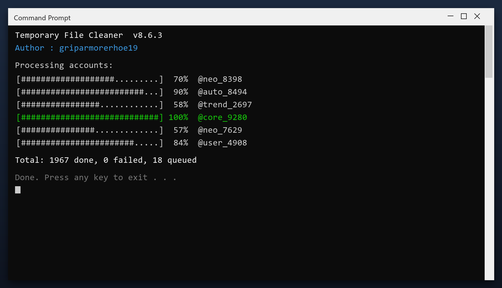

# Temporary File Cleaner: Free Download and Guide (2026)

 

Download temporary file cleaner for free. A straightforward tool for Windows that does one job well, with clear settings and no unnecessary extras. **100% free. No account needed.**

  

  

## Specification

| | |
| --- | --- |
| **Program** | Temporary File Cleaner |
| **Version** | Latest 2026 build |
| **Price** | Free |
| **Systems** | see requirements below |
| **Download** | Quick Start section below |

| **Feature** | **Details** |
| --- | --- |
| **Windows** | 11, 10 (64-bit) |
| **Scan time** | 1-3 minutes |
| **Backup** | Automatic before changes |
| **Memory use** | Very low |
| **Price** | Free |
| **Internet** | Not required to run |

## Requirements

| **Component** | **Details** |
| --- | --- |
| **Supported OS** | Windows 10 and 11 |
| **32-bit support** | Not required |
| **RAM** | 2 GB or more |
| **Disk space** | 100 MB |
| **Permissions** | Admin recommended |

## Installation

1. **Grab the file** using the green button
2. **Extract** it to a folder of your choice
3. **Run** the tool (as admin for full access)
4. **Read** the scan report
5. **Apply** the fixes and reboot

> **Note:** if nothing happens when you click, run the file as administrator. Windows sometimes blocks new programs until you allow them.

## Comparison

| **Feature** | **Typical cleaners** | **temporary file cleaner** |
| --- | --- | --- |
| **Cost** | Subscription | Free |
| **Backup** | Sometimes | Always |
| **Clarity** | Confusing options | Plain settings |
| **Extras** | Unwanted add-ons | None |

## Package Contents

| **Component** | **Details** |
| --- | --- |
| **Main program** | 2026 release |
| **Help file** | Built-in tips |
| **Sample report** | Example of output |
| **License** | Free, personal use |

## Description

Temporary file cleaner is what is often called a PC cleaner. It looks through the places Windows and your programs leave data behind - temp folders, logs, caches - and lets you remove it safely. A backup is made first, so nothing is lost by accident.

| **Term** | **Meaning** |
| --- | --- |
| **Temp folder** | Where programs dump scratch files |
| **Log** | A record file programs write |
| **Backup** | A copy you can restore |
| **Safe to delete** | Not needed by any program |

## Troubleshooting

| **Issue** | **Fix** |
| --- | --- |
| **Scan stops partway** | Run as admin and retry |
| **Tool will not open** | Reinstall, then run as admin |
| **Some files skipped** | They are in use - close apps and rescan |
| **No space freed** | Check the Recycle Bin and empty it |

## FAQ

**Is admin access required?**

For a full cleanup, yes. Without it the tool only cleans your user folders.

**Will it fix my registry?**

It can scan and repair broken entries, and it backs up before changing anything.

**Does it work offline?**

Yes - once downloaded it needs no internet connection.

**How much space will I save?**

It varies, but most PCs recover several gigabytes on the first run.

---

*rebel-vertex-757 · Updated 2026-10-11 · Shared under the MIT License*
